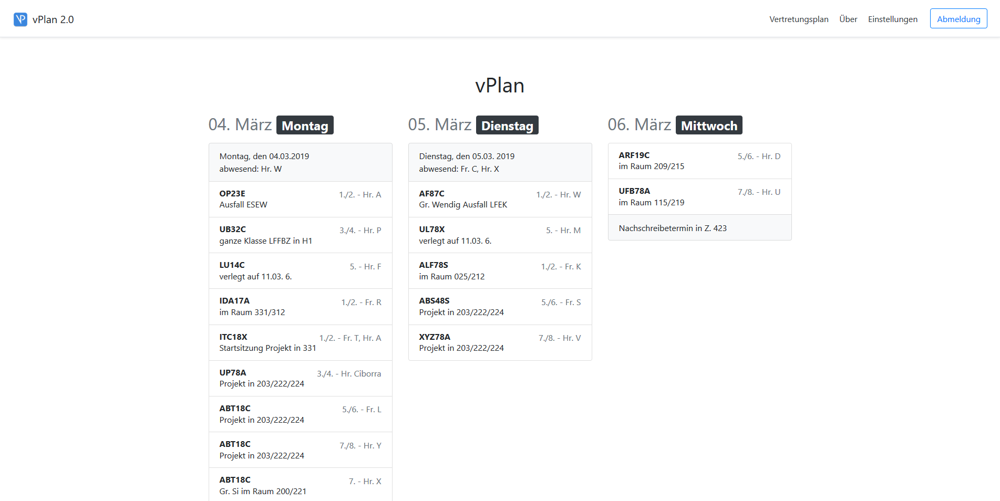
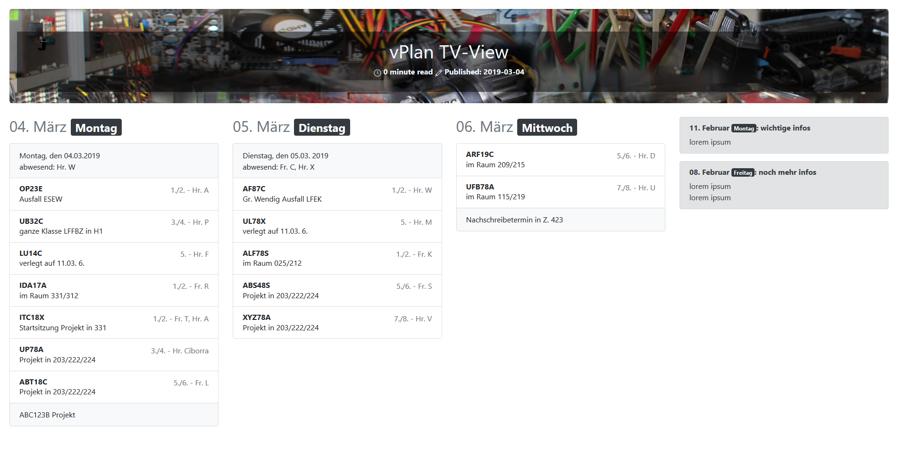
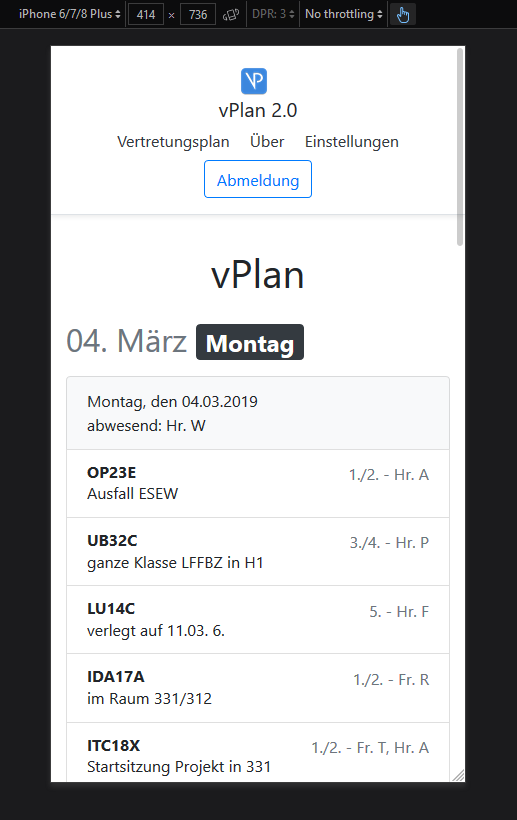

    
    <h1>~ vPlan 2.0 ~</h1>
    <strong>
        Substitution plan system for schools
    </strong>  
    &nbsp;
    
 

---

# Introduction

In scope of our project work, we have created a rework of our substitution plan system of our school. We have focused our targets to improve display style, handling and responsiveness. Also, we wanted to create this project to be run completely stand-alone with a connection to a MySQL server as database and an authentication server which is accessable via LDAP.

Because of the limited time (2 weeks) of our project phase, we were only able to implement a part of our traget features. [Below](#ideas), you can find a list with ideas, which features are planned.

---

# Screenshots

---

# Technology

## Front End

We have used HTML5 in combination with JavaScript for dynamically requesting data from the back end server using the native `XMLHttpRequest` library and building the interface structure.  
We have used [`zola`](https://github.com/getzola/zola) as site generator and template compiler to minify and simplify our front end source files. Also, we have used [`Bootstrap 4`](https://getbootstrap.com/) as design toolkit for a cleaner, more consistent and responsive design.

## Back End

For the REST API, database and authentication server access, we have decided to use the language [`Go`](https://golang.org/). Because of it's omtimization for web applications, the easy to maintain structure, the ability to cross-compile, the easy to deploy self-containing binaries and the variety of standard libraries *(`net/http` or `database/sql` for example)* and community driven open source packages *(like the gorilla web toolkit)*, Go was the perfect choise for our back end.  
It was also in discussion to use Rust as backend technology because of it's safety and stability, but we decided against because we had way more experience with Go and so we were not be able to estimate the time we would need to create the back end functionalities in Rust.

## Dependencies

[**Here**](docs/dependencies.md) you can find a detailed list of dependencies and their licences we have used in this project.

---

# Ideas

- [ ] Dark Theme
- [ ] Photon Themes Design instead of standard bootstrap design
- [ ] Better way to display much data on the TV view
- [ ] Creation of substitution plans inside the envoirement

---

# Setup and Installation

Below, you can find the documents for how to build and install the backend and frontend of vPlan2.

- [Building](docs/build.md)
- [Installation](docs/setup.md)
- [MySQL Database Structure](docs/database-structure.md)

---

© 2019 Justin Trommler, Richard Heidenreich, Ringo Hoffmann  
Covered by MIT Licence.
